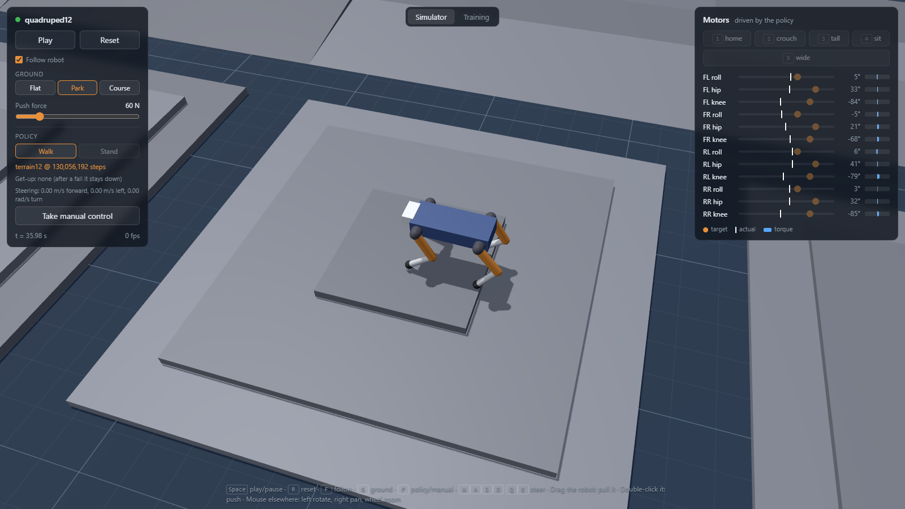
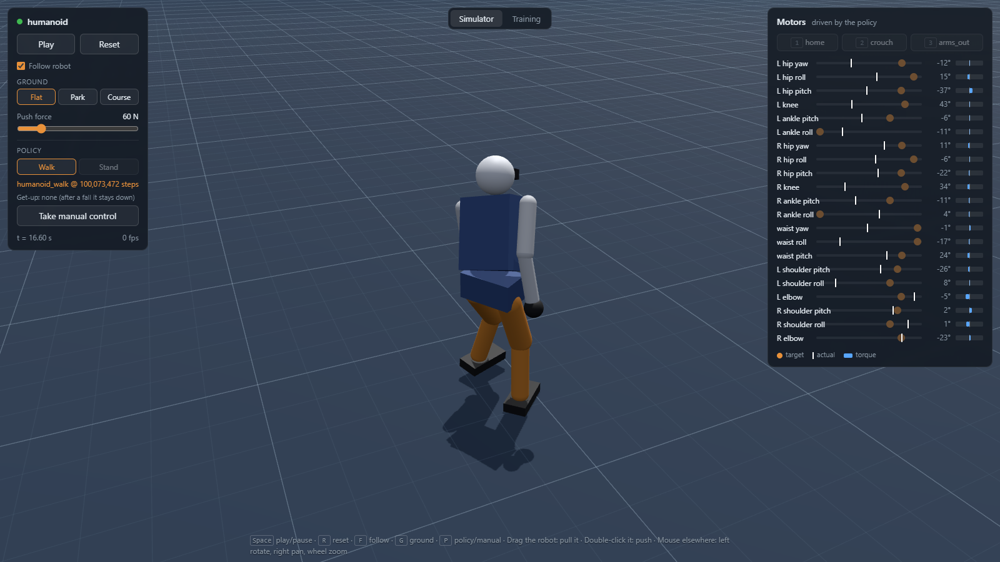
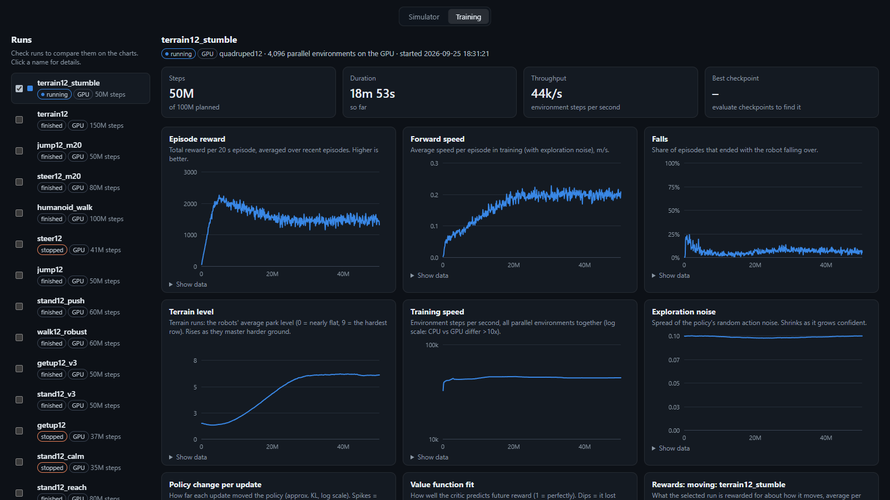

# robot3d

Design legged robots, watch them in 3D in the browser, control them, and train
them with reinforcement learning. Physics runs in [MuJoCo](https://mujoco.org)
(on the GPU with [MuJoCo Warp](https://github.com/google-deepmind/mujoco_warp)),
the viewer in [three.js](https://threejs.org).



## What it does

- **Robots as data**: MJCF files in `robots/`: an 8-motor and a 12-motor
  quadruped, and a 21-motor child-size humanoid.
- **Browser viewer**: play/pause, a slider per motor, pose presets, drag or
  push the robot with the mouse, steer with the keyboard or a gamepad.
- **Training**: PPO on the CPU (Stable-Baselines3) or on the GPU (4096 robots
  at once). Tasks: walk, steer, stand still, get up after a fall, jump.
- **Terrain**: rough ground, slopes, stairs and obstacles with a difficulty
  curriculum, a height map the robot sees, and a test course of shapes it
  never trained on.
- **Dashboard**: training curves, checkpoints, evaluations, and "Watch" to
  replay any checkpoint in the viewer.

<p>
  
  
</p>

## Setup

Needs [uv](https://docs.astral.sh/uv/) (Python 3.12) and Node.js. GPU training
needs an NVIDIA GPU; everything else runs on the CPU.

```sh
uv sync
cd web && npm install
```

`pyproject.toml` installs the CUDA 13.0 build of PyTorch. On a machine without
an NVIDIA GPU, point `[[tool.uv.index]]` at `https://download.pytorch.org/whl/cpu`.

## Run

```sh
uv run scripts/serve.py        # simulation server on :8000
cd web && npm run dev          # the page on http://localhost:5173
```

Trained policies aren't included (`runs/` is not in the repo). Train one, then
open it from the page's **Training** tab:

```sh
uv run scripts/train_gpu.py --robot quadruped12 --name walk12       # GPU: walk
uv run scripts/train_gpu.py --robot quadruped12 --task steer --init runs/walk12 --name steer12
uv run scripts/train_gpu.py --robot quadruped12 --task steer --terrain --init runs/steer12
uv run scripts/train.py                                             # CPU: the 8-motor quadruped
```

Other tasks: `--task stand|getup|jump`. `--init runs/<name>` fine-tunes an
existing run. `uv run scripts/evaluate.py runs/<name>` tests a run headless.

## Tests

```sh
uv run pytest                  # GPU tests skip without CUDA
cd web && npm run build        # type-check + production build
```

## Layout

```
robots/        robot models (MJCF)
src/robot3d/   simulation, tasks, training, server
scripts/       serve, train, train_gpu, evaluate, view_mujoco
web/           the browser app (TypeScript, three.js)
tests/         pytest
docs/          design notes and the decision log
```
